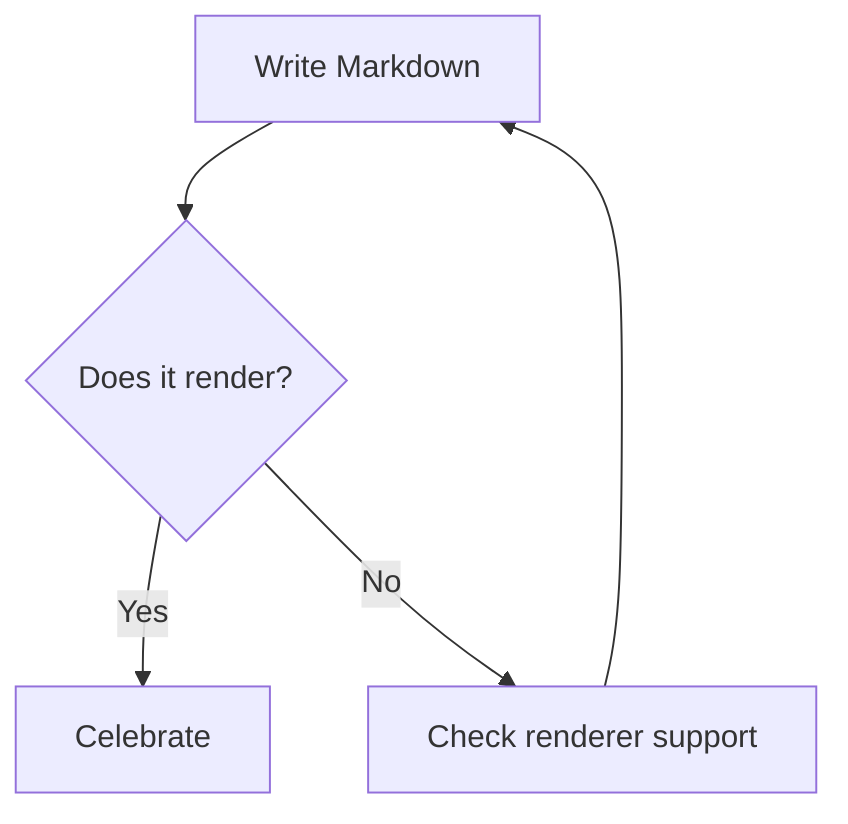
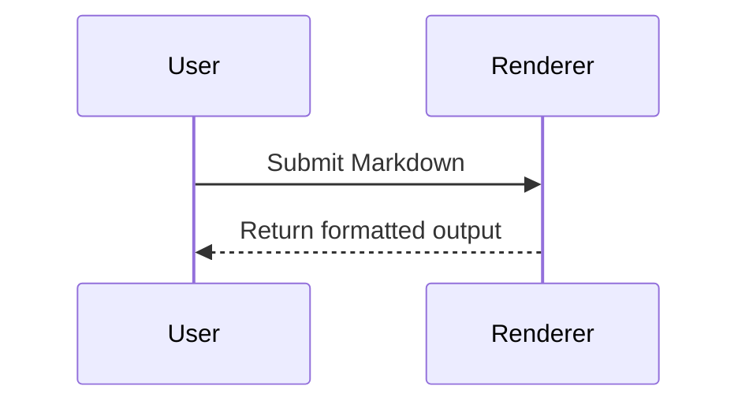

Hello, world! This should apparently render.

> **Note:** Markdown support varies between renderers. Some features below require GitHub-Flavored Markdown, CommonMark extensions, or plugins.

---

## Text Formatting

Regular text.

*Italic text*
*Also italic text*

**Bold text**
**Also bold text**

***Bold and italic text***
***Also bold and italic text***

~~Strikethrough text~~

`Inline code`

This sentence contains **bold text with *nested italics* inside it**.

This sentence uses an escaped character: *not italic*.

You can also use HTML for <u>underlined text</u>, <mark>highlighted text</mark>, <small>small text</small>, H<sub>2</sub>O, and x<sup>2</sup>.

---

# Heading Level 1

## Heading Level 2

### Heading Level 3

#### Heading Level 4

##### Heading Level 5

###### Heading Level 6

# Alternative Heading Level 1

## Alternative Heading Level 2

## Paragraphs and Line Breaks

This is one paragraph. It contains multiple sentences but remains one paragraph until a blank line appears.

This is a new paragraph.

This line ends with two spaces.
Therefore, this text starts on a new line.

This line uses an HTML break.<br>
This text also starts on a new line.

---

## Unordered Lists

* First item
* Second item
* Third item

  * Nested item
  * Another nested item

    * Deeply nested item
* Final item

Alternative markers:

* Item using an asterisk
* Another item

  * Nested item using a plus sign
  * Another nested item

## Ordered Lists

1. First item
2. Second item
3. Third item

   1. Nested numbered item
   2. Another nested numbered item
4. Fourth item

Markdown can automatically number items:

1. Alpha
2. Beta
3. Gamma

Starting from another number:

5. Fifth item
6. Sixth item
7. Seventh item

## Mixed Lists

1. Install the application.
2. Configure the project:

   * Add a configuration file.
   * Set the environment variables.
   * Confirm the settings.
3. Run the application:

   ```bash
   npm run start
   ```
4. Check the output.

## Task Lists

* [x] Create the Markdown test
* [x] Add common syntax
* [ ] Test every renderer
* [ ] Fix unsupported features

  * [x] Test nested tasks
  * [ ] Document the results

---

## Links

[Example](https://example.com)

[Link with a title](https://example.com "Example website")

https://example.com

[hello@example.com](mailto:hello@example.com)

Reference-style link to [Example][example-link].

Another link to the [same destination][example-link].

[example-link]: https://example.com "Reference link title"

Internal link to the [Code Blocks](#code-blocks) section.

---

## Images


Image with a title:


Reference-style image:

![Reference placeholder][placeholder-image]

[placeholder-image]: https://placehold.co/300x120?text=Reference+Image

Linked image:

[](https://example.com)

---

## Blockquotes

> This is a blockquote.
>
> It can contain multiple paragraphs.
>
> **Formatting** and `inline code` work inside it.

Nested blockquotes:

> Level one
>
> > Level two
> >
> > > Level three

A blockquote containing a list:

> ### Quoted Checklist
>
> * First quoted item
> * Second quoted item
> * [x] Completed quoted task

---

## Code Blocks

Inline code looks like `const answer = 42;`.

Use double backticks when the code itself contains a backtick:

``Use `code` inside an inline code span.``

Indented code block:

```
function greet(name) {
  return `Hello, ${name}!`;
}
```

Fenced JavaScript block:

```javascript
/**
 * Returns a greeting for the supplied name.
 * @param {string} name
 * @returns {string}
 */
function greet(name) {
  if (!name) {
    throw new Error("A name is required.");
  }

  return `Hello, ${name}!`;
}

console.log(greet("World"));
```

Python:

```python
from dataclasses import dataclass


@dataclass
class Person:
    name: str
    age: int


def describe(person: Person) -> str:
    return f"{person.name} is {person.age} years old."


print(describe(Person(name="Ada", age=36)))
```

Shell:

```bash
#!/usr/bin/env bash
set -euo pipefail

echo "Current directory: $(pwd)"
ls -la
```

JSON:

```json
{
  "name": "Markdown Test",
  "enabled": true,
  "features": [
    "headings",
    "lists",
    "tables",
    "code"
  ],
  "metadata": null
}
```

HTML:

```html
<article>
  <h1>Hello, Markdown!</h1>
  <p>This HTML is displayed as code.</p>
</article>
```

CSS:

```css
.markdown-test {
  display: grid;
  gap: 1rem;
  max-width: 72ch;
}
```

SQL:

```sql
SELECT
    user_id,
    COUNT(*) AS order_count
FROM orders
WHERE created_at >= '2026-01-01'
GROUP BY user_id
ORDER BY order_count DESC;
```

Diff:

```diff
- const enabled = false;
+ const enabled = true;

  console.log("Feature status:", enabled);
```

Plain text:

```text
No syntax highlighting should be applied here.
Special characters: * _ # > [ ] { } & < >
```

---

## Tables

| Feature   | Supported? |                 Notes |
| :-------- | :--------: | --------------------: |
| Headings  |     Yes    |            Six levels |
| Lists     |     Yes    | Ordered and unordered |
| Tables    |   Usually  |         Common in GFM |
| Footnotes |   Varies   |    Renderer-dependent |
| HTML      |   Varies   |      May be sanitized |

Table with formatting:

| Name   | Description     | Example                        |
| ------ | --------------- | ------------------------------ |
| Bold   | Strong emphasis | **Hello**                      |
| Italic | Emphasis        | *Hello*                        |
| Code   | Inline code     | `hello()`                      |
| Link   | Hyperlink       | [Example](https://example.com) |

Escaped pipe inside a table:

| Expression | Meaning                  |
| ---------- | ------------------------ |
| `A \| B`   | A literal pipe character |
| `A && B`   | Logical AND              |

---

## Horizontal Rules

Three hyphens:

---

Three asterisks:

---

Three underscores:

---

---

## Footnotes

Here is a sentence with a footnote.[^1]

Footnotes can also have descriptive identifiers.[^markdown-note]

A footnote can be reused.[^1]

[^1]: This is the first footnote.

[^markdown-note]: Footnote support depends on the Markdown renderer.

    A footnote may also contain an indented second paragraph.

---

## Definition Lists

Some renderers support definition lists.

Markdown
: A lightweight markup language.

Renderer
: Software that converts Markdown into another format, usually HTML.

Multiple definitions
: First definition.
: Second definition.

---

## Mathematical Notation

Inline mathematics may render as $E = mc^2$.

Display mathematics:

$$
\frac{-b \pm \sqrt{b^2 - 4ac}}{2a}
$$

Another example:

$$
\sum_{i=1}^{n} i = \frac{n(n+1)}{2}
$$

---

## HTML Elements

<details>
<summary>Expand this section</summary>

This content is hidden until the disclosure element is opened.

* It can contain lists.
* It may support **Markdown formatting**.
* Exact behavior depends on the renderer.

</details>

<details open>
<summary>This section starts open</summary>

The `open` attribute makes the content initially visible.

</details>

Keyboard input: Press <kbd>Ctrl</kbd> + <kbd>C</kbd> to copy.

Abbreviation support may vary: <abbr title="HyperText Markup Language">HTML</abbr>.

A progress element may render as HTML:

<progress value="70" max="100">70%</progress>

---

## Emojis and Symbols

Native emoji: 🚀 🎉 ✅ ⚠️ ❌ 🧪 📚

Emoji shortcode support varies: `:rocket:` `:tada:` `:white_check_mark:`

Copyright: ©
Registered trademark: ®
Trademark: ™
Arrow: →
Em dash: —
Ellipsis: …

---

## Escaping Special Characters

\# This is not a heading.

\- This is not a list item.

\> This is not a blockquote.

\*This is not italic text.\*

\[This is not a link\](https://example.com)

Literal backslash: `\`

Characters commonly escaped in Markdown:

```text
\ ` * _ { } [ ] < > ( ) # + - . ! |
```

---

## Nested Formatting

* **Bold list item**

  * *Italic nested item*

    * `Code in a deeply nested item`

      * [A deeply nested link](https://example.com)

> **Blockquote with a list and code**
>
> 1. First step
>
> 2. Run:
>
>    ```bash
>    echo "Hello from a quoted code block"
>    ```
>
> 3. Finish.

---

## Long Line and Special Cases

Averylongunbrokentokenusedtotestwrappingbehaviorandhorizontaloverflowinrenderersthatmayormaynothandleextremelylongcontentgracefully1234567890.

URLs may be automatically linked depending on the renderer: https://example.com/path/to/page?query=markdown&enabled=true#section

Repeated punctuation:

* Asterisks: `**********`
* Underscores: `__________`
* Backticks: `` ` ``
* Hash symbols: `######`
* Greater-than symbols: `>>>>>>`

---

## Comments

The following HTML comment should normally be hidden:

<!-- This is a hidden HTML comment. -->

The text before and after the comment should remain visible.

---

## Front Matter

Some static-site generators interpret content at the beginning of a document like this:

```yaml
---
title: Markdown Feature Test
author: Example Author
date: 2026-06-25
tags:
  - markdown
  - testing
draft: false
---
```

---

## Mermaid Diagram

Some renderers support Mermaid diagrams:



Sequence diagram:



---

## Alerts and Callouts

GitHub-style alerts may render on supported platforms:

> [!NOTE]
> This is a note.

> [!TIP]
> This is a helpful tip.

> [!IMPORTANT]
> This information is important.

> [!WARNING]
> Proceed carefully.

> [!CAUTION]
> This action may have consequences.

---

## Citations and Superscript Alternatives

A citation-like reference: [Smith, 2026](#references).

Superscript using HTML: 1<sup>st</sup>, 2<sup>nd</sup>, 3<sup>rd</sup>.

Subscript using HTML: CO<sub>2</sub>.

---

## References

1. <a id="references"></a>Smith, A. *An Imaginary Guide to Markdown*. Example Press, 2026.
2. Markdown syntax differs across implementations.
3. Test important content in the renderer where it will ultimately be published.

---

## Final Checklist

* [x] Headings
* [x] Emphasis
* [x] Strikethrough
* [x] Ordered and unordered lists
* [x] Nested lists
* [x] Task lists
* [x] Links
* [x] Images
* [x] Blockquotes
* [x] Inline and fenced code
* [x] Tables
* [x] Horizontal rules
* [x] Footnotes
* [x] HTML
* [x] Mathematical notation
* [x] Mermaid diagrams
* [x] Alerts
* [x] Escaped characters
* [x] Emoji
* [ ] Guaranteed support in every Markdown renderer

---

**End of Markdown test.**
